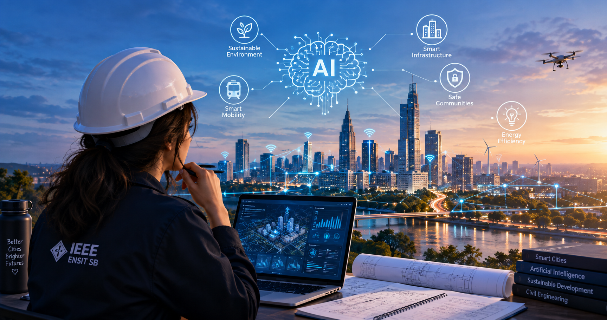

#  Hey, I'm Ahlem Ben Ali

  

---

## ⚡ Quick Intro

- 🏗️ Civil Engineering student at **ENSIT**, Tunis
- 🧱 Solid background in reinforced concrete (Eurocode 2), steel structures (Eurocode 3), and BIM
- 🤖 Exploring the intersection of **Construction × AI**: Digital Twins, data-driven dashboards, ML forecasting
- 🎤 **President** of the IEEE ENSIT Student Branch — leadership, team management & communication
- 🌍 Trilingual Arabic / French / English + fluent German

## 🔥 Contribution Streak

---

# 🏗️ The Crane That Ate My Commits 🐍

---

## 🛠️ Tools, Software & Skills

---

## 🧭 My Journey

### 🎓 Current
- **Engineering Degree — Civil Engineering**, ENSIT, Tunis *(in progress)*
- **President**, IEEE ENSIT Student Branch *(2024 – Present)*

### 🏗️ Key Projects
- **Final Year Project — Basement + Ground Floor + 2 Stories Building** (Hammamet) — Reinforced concrete design per EC2, modeled in Robot Structural Analysis
- **CAD & Structural Modeling — R+2 Building** — AutoCAD, ARCHE Ossature, load distribution & rebar design
- **22×60 m Steel Hangar** (Tabarka) — 3D modeling in S235 steel, Eurocode 3, buckling checks, bolted connections
- **BIM & Digital Transformation in Construction** — Study of BIM / AI / Digital Twins synergies

### 🎓 Education
- **Engineering Degree, Civil Engineering** — ENSIT, Tunis
- **Preparatory Classes, PC track** (Physics-Chemistry) — IPEIEM, Tunis
- **High School Diploma, Sciences — Honors** — Lycée Nouvelle Médina Ben Arous

### 🌐 Info
- Tunis, Tunisia | ahlembenali064@gmail.com | +216 90 248 886
- Languages: Arabic (Native), French (Fluent), English (Fluent), German (Fluent)

---

## 🧩 Side Projects

- **ECO DATA** — Campus Carbon Intelligence Platform *(ENSIT GreenTech Challenge 2026)*: interactive dashboard for carbon emissions analysis and decision support
- **NeuroLearn** — AI EdTech Platform *(IEEE Education Week Challenge)*: smart AI-based educational platform

---

### 🏆 Certifications & Events

- Civil Engineering Structures Day — JOA'25
- Tunisia Digital Summit TDS 9 (BIM & Smart Cities)
- Climate Risk Management
- SDG 15
- TSYP 12 & 13

---

### 🙎‍♀️ Leadership & Activities

- 🏆 **President** — IEEE ENSIT Student Branch, Tunisia Section *(2024 – Present)*
  - Coordinated a team of volunteers and organized events
  - Managed relationships with members, partners, and participants
  - Handled administrative follow-up and communication with stakeholders
- 📣 **Digital Communication Officer** — IEEE ENSIT Student Branch
  - Managed social media (Facebook, Instagram, LinkedIn)
  - Created promotional content and monitored online communication

**IEEE Awards:**
- 🥇 1st place — RAS & VTS Challenge, TSYP 13
- 🥉 3rd place — SIGHT, TEMS & SSIT Challenge, TSYP 13
- 🏆 "Most Outstanding Student Branch — Large Category" — TSYP 12

## 🤝 Connect With Me

  

❤️ Thanks for stopping by my profile!
© Ahlem Ben Ali

